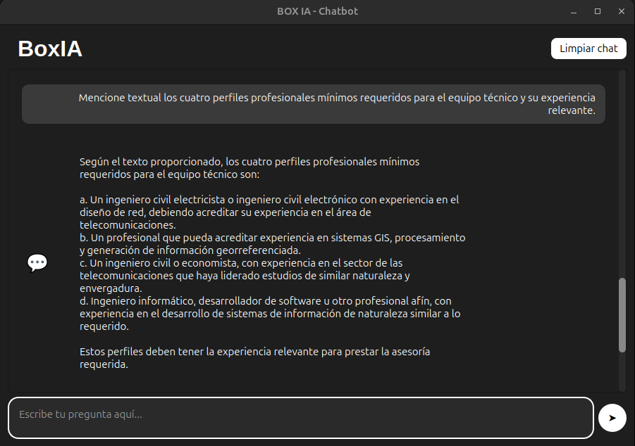
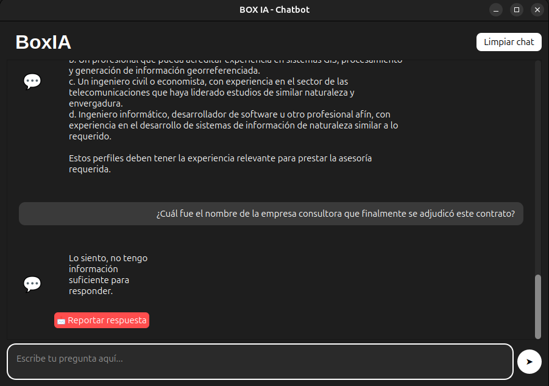
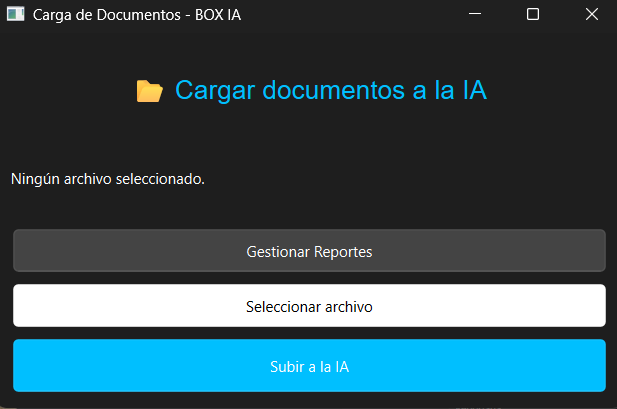
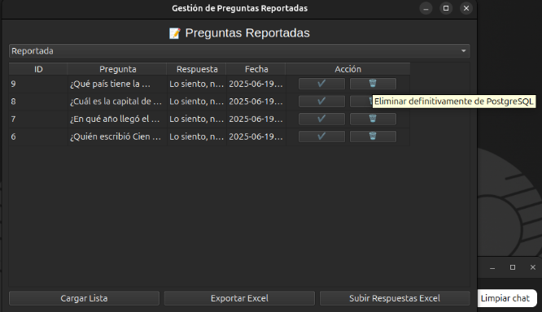

# 📦 Backend - Documentación Técnica

Este proyecto corresponde al backend de una aplicación RAG local (Retrieval-Augmented Generation) con FastAPI, Ollama, ChromaDB y PostgreSQL. A continuación se documentaran los distintos archivos presentes en el proyecto.

## 📁 Estructura General de `api.py`

- **Inicialización de la aplicación FastAPI**
- **Conexión a PostgreSQL:** incluye una función que asegura que la tabla `reported_questions` se cree al iniciar el servidor.
- **Inicialización de modelos:**
  - Modelo de lenguaje (`llama3.1`) cargado desde Ollama.
  - Embeddings generados con `FastEmbed`.
  - Base vectorial persistente con `ChromaDB`.
- **Creación de prompt personalizado instructivo**
- **Construcción de cadena RAG con `RetrievalQA`**

> 💡 La base de datos vectorial se crea al primer arranque del sistema, y en caso de ser eliminada manualmente, se reconstruye vacía en el próximo inicio.

## 🧠 Prompt Personalizado

El sistema utiliza un prompt rígido y fundamentado que obliga al modelo a responder únicamente con base en el contexto entregado. Incluye reglas claras para rechazar preguntas no relacionadas o sin información suficiente.

---

## 🚀 Endpoints disponibles

### `POST /preguntar`
Permite hacer una pregunta y obtener una respuesta generada por el modelo IA basada solo en documentos cargados.  
- Si no hay suficiente contexto relevante, responde: `"Lo siento, no tengo información suficiente para responder."`

---

### `POST /cargar-documento-pdf`
Permite cargar documentos PDF a la base vectorial.  
- Aplica limpieza de texto.
- Divide el contenido en fragmentos (`chunk_size=1800`, `overlap=500`).
- Persiste en ChromaDB.

---

### `POST /reportar-pregunta`
Permite al usuario reportar una pregunta cuya respuesta fue incorrecta.  
- Registra en PostgreSQL en el estado `"reportada"`.
- Si ya existía, se reactiva el reporte.

---

### `GET /preguntas-reportadas?estado=reportada|revisada|eliminada|todas`
Entrega la lista de preguntas reportadas filtradas por su estado.

---

### `POST /marcar-revisado`
Marca una pregunta reportada como revisada (no se elimina, pero pasa a estado `"revisada"`).

---

### `GET /exportar-preguntas?estado=reportada|revisada|eliminada`
Exporta las preguntas reportadas a un archivo Excel con columnas: `ID`, `Pregunta`, `Respuesta Experto`.

---

### `POST /subir-respuestas-excel`
Permite cargar un archivo Excel con respuestas del experto.  
- Las respuestas se fragmentan y se añaden a la base vectorial.
- Actualiza la base de datos marcando como `"revisadas"`.

---

### `POST /eliminar-pregunta`
Elimina definitivamente una pregunta reportada desde PostgreSQL.

---

### `POST /eliminar-de-chroma`
Elimina todos los chunks relacionados desde ChromaDB usando el ID base.  
- También actualiza el estado en la base de datos a `"eliminada"`.

---

### `POST /reactivar-pregunta`
Permite volver a marcar como `"reportada"` una pregunta que fue eliminada previamente.

---

## 🔗 Dependencias importantes
Estas dependencias estan disponibles para ser instaladas desde requeriments.txt

- `FastAPI`
- `psycopg2`
- `pandas`, `openpyxl`
- `langchain`, `Ollama`, `FastEmbed`, `Chroma`
- `PyPDFLoader` para procesar documentos PDF

---

## 🔌 Archivo `conexion.py`

Este módulo se encarga de establecer la conexión a la base de datos PostgreSQL. Es utilizado por varios endpoints del archivo `api.py` para insertar, actualizar y eliminar preguntas reportadas.

### 🧱 Estructura

```python
import psycopg2

conexion = psycopg2.connect(
    dbname="boxia_db",
    user="boxia_user",
    password="boxia",
    host="postgres"
)
```


## 🐳 Dockerización del proyecto (`Dockerfile` y `docker-compose.yml`)

El backend completo de BoxIA se puede levantar de forma totalmente local y aislada usando Docker. A continuación, se describen los dos archivos clave que lo hacen posible: el `Dockerfile` y el `docker-compose.yml`.

---

### 📦 `Dockerfile`

Este archivo define la imagen personalizada para el servicio principal (`boxia`), que ejecuta la API de FastAPI.

```dockerfile
FROM python:3.10-slim

WORKDIR /app

COPY requirements.txt .
RUN pip install --no-cache-dir -r requirements.txt

COPY . .

ENV POSTGRES_DB=boxia_db
ENV POSTGRES_USER=boxia_user
ENV POSTGRES_PASSWORD=boxia
ENV POSTGRES_HOST=postgres
ENV POSTGRES_PORT=5432

EXPOSE 8000

CMD ["uvicorn", "api:app", "--host", "0.0.0.0", "--port", "8000"]
```
### 🛠️ `docker-compose.yml`
Este archivo define y orquesta los tres servicios principales:
  - PostgreSQL (para almacenamiento de preguntas reportadas)
  - Ollama (modelo LLaMA 3.1 local)
  - BoxIA (contenedor que ejecuta la API)
```docker-compose.yml
version: '3.8'

services:
  postgres:
    image: postgres:15
    container_name: boxia-postgres-1
    restart: always
    environment:
      POSTGRES_USER: boxia_user
      POSTGRES_PASSWORD: boxia
      POSTGRES_DB: boxia_db
    ports:
      - "5432:5432"
    volumes:
      - boxia_pgdata:/var/lib/postgresql/data
      - ./postgres_init/init.sql:/docker-entrypoint-initdb.d/init.sql
    healthcheck:
      test: ["CMD-SHELL", "pg_isready -U boxia_user -d boxia_db"]
      interval: 5s
      timeout: 5s
      retries: 10

  ollama:
    image: ollama/ollama
    container_name: ollama
    restart: always
    deploy:
      resources:
        reservations:
          devices:
            - driver: nvidia
              count: all
              capabilities: [gpu]
    entrypoint: >
      /bin/sh -c "ollama serve & sleep 10 && ollama pull llama3.1 && tail -f /dev/null"
    ports:
      - "11434:11434"
    volumes:
      - ollama_models:/root/.ollama

  boxia:
    build:
      context: .
      dockerfile: Dockerfile
    container_name: boxia-boxia-1
    restart: always
    ports:
      - "8000:8000"
    depends_on:
      postgres:
        condition: service_healthy
      ollama:
        condition: service_started
    environment:
      POSTGRES_HOST: postgres
      POSTGRES_USER: boxia_user
      POSTGRES_PASSWORD: boxia
      POSTGRES_DB: boxia_db
    volumes:
      - ./chroma_db_dir:/app/chroma_db_dir
      - ./docs:/app/docs

volumes:
  boxia_pgdata:
  ollama_models:
```

---

## ⚙️ Comandos utiles para el backend
```bash
-Para borrar el ambiente virtual anterior:
rm -rf boxia-env
-Para crear el ambiente virtual:
python3 -m venv boxia-env
-Para usar el ambiente virtual: 
source boxia-env/bin/activate
-Para desactivar el ambiente virtual:
deactivate
-Instalar dependencias:
pip install -r requirements.txt
-Para borrar la BD:
rm -r chroma_db_dir
-Arrancar el proyecto desde la api:
uvicorn api:app --reload
-Levantar el proyecto desde el docker:
sudo docker compose up --build
-Detener todo el contenido del docker:
sudo docker compose down

```

---

# 📦 FrontEnd - Documentación Técnica

Este proyecto corresponde al frontend para la inteligencia artificial local mencionada anteriormente, cabe recalcar que estas capas visuales estan desarrolladas para funcionar en distintos hardware (hardware del usuario experto y hardware del usuario general), ademas se encuentra un archivo postable .bin con la unterfaz visual compilada en la carpeta ./dist . A continuación se documentaran los distintos archivos presentes en el proyecto.

## 💬 Interfaz de Usuario General: `interfaz_chat.py`

Esta interfaz gráfica permite a los usuarios hacer preguntas directamente al sistema de IA y recibir respuestas inmediatas. La aplicación está construida con **PyQt6** y se conecta al backend vía HTTP usando `requests`.

📁 Ruta del archivo: `interfaz_chat.py`  

---

### 🖥️ Vista general




---

### ✨ Funcionalidades principales

- **Campo de entrada de texto** para escribir preguntas.
- **Botón "➤"** para enviar la solicitud al backend (`/preguntar`).
- **Visualización del historial de conversación**, tanto del usuario como de la IA.
- **Botón "Limpiar chat"** para reiniciar la conversación.
- **Botón "📩 Reportar respuesta"** bajo cada respuesta de la IA para marcar respuestas incorrectas (envía los datos a `/reportar-pregunta`).

---

### ⚙️ Flujo general

1. El usuario escribe una pregunta.
2. Se envía una petición POST al endpoint `http://localhost:8000/preguntar`.
3. Se renderiza la respuesta de la IA en la interfaz.
4. Si la respuesta no es adecuada, el usuario puede reportarla.
5. El sistema guarda automáticamente la última pregunta y respuesta para fines de reporte.

---

### 🎨 Estética y diseño

- Interfaz **oscura y moderna** con soporte para scroll y texto seleccionable.
- Autoajuste dinámico del área de entrada al crecer el texto.
- Uso de íconos como 💬 para mejorar la experiencia visual.

---
## 🧠 Interfaz de Usuario Experto: `interfaz_docs.py` + `manage_reports.py`

Esta sección está dedicada a los usuarios con rol experto. Incluye herramientas para cargar documentos y gestionar preguntas reportadas por los usuarios generales. Ambas interfaces están desarrolladas con **PyQt6** y se conectan al backend mediante peticiones HTTP.

📁 Archivos:
- `interfaz_docs.py`: carga de documentos PDF y acceso a la gestión de reportes.
- `manage_reports.py`: gestión completa de preguntas reportadas.

---

### 📂 Carga de Documentos



- Permite seleccionar archivos `.pdf` y subirlos al sistema vía `/cargar-documento-pdf`.
- Muestra el estado de carga en tiempo real.
- Contiene un botón adicional para abrir la ventana de gestión de reportes.

---

### 📝 Gestión de Preguntas Reportadas



Desde `manage_reports.py`, se puede:

#### 🔍 Filtrar por estado
- Reportadas
- Revisadas
- Eliminadas

#### 📋 Visualización
- Muestra en tabla: ID, pregunta, respuesta IA, fecha, respuesta del experto (si corresponde) y botones de acción.

#### 🧰 Acciones disponibles
Según el estado del reporte, se habilitan diferentes botones:

| Estado      | Acciones Disponibles                                   |
|-------------|--------------------------------------------------------|
| Reportada   | ✔️ Marcar como revisada<br>🗑️ Eliminar de Postgresql   |
| Revisada    | 🗑️ Eliminar de Chroma<br>🔄 Reactivar como reportada   |
| Eliminada   | 🔄 Reactivar como reportada                            |

---

### 📤 Funciones de exportación y carga

- **Exportar Excel**: descarga un archivo `.xlsx` con los reportes actuales (`/exportar-preguntas`).
- **Cargar Excel con respuestas de experto**: permite subir archivos que contienen respuestas expertas para actualizarlas en lote (`/subir-respuestas-excel`).

---

## ⚙️ Comandos utiles para el frontend
```bash
Comandos para UsuarioExperto

-Para borrar el ambiente virtual anterior:
rm -rf docs-env
-Para crear el ambiente virtual:
python3 -m venv docs-env
-Para usar el ambiente virtual: 
source docs-env/bin/activate
-Para desactivar el ambiente virtual:
deactivate
-Instalar dependencias:
pip install -r requirements.txt
-Arrancar la interfaz:
python3 interfaz_docs.py
-Generar portable de la interfaz:
pyinstaller --onefile --windowed --name BoxIA-Experto interfaz_docs.py

Comandos para UsuarioGeneral

UBUNTU
-Para borrar el ambiente virtual anterior:
rm -rf chat-env
-Para crear el ambiente virtual:
python3 -m venv chat-env
-Para usar el ambiente virtual: 
source chat-env/bin/activate
-Para desactivar el ambiente virtual:
deactivate
-Instalar dependencias:
pip install -r requirements.txt
-Arrancar la interfaz:
python3 interfaz_chat.py
-Generar portable del chat:
pyinstaller --onefile --windowed --name BoxIA-Chat interfaz_chat.py

```
```
 ______                    _____       _         ______   ____   ____      _____   _____     
|_   _ \                  |_   _|     / \       |_   _ `.|_  _| |_  _|    |_   _| |_   _|    
  | |_) |   .--.   _   __   | |      / _ \        | | `. \ \ \   / /        | |     | |      
  |  __'. / .'`\ \[ \ [  ]  | |     / ___ \       | |  | |  \ \ / /     _   | |     | |   _  
 _| |__) || \__. | > '  <  _| |_  _/ /   \ \_    _| |_.' /_  \ ' /     | |__' | _  _| |__/ | 
|_______/  '.__.' [__]`\_]|_____||____| |____|  |______.'(_)  \_/      `.____.'(_)|________| 
                                                                                             
```                                                                                                                                                   
